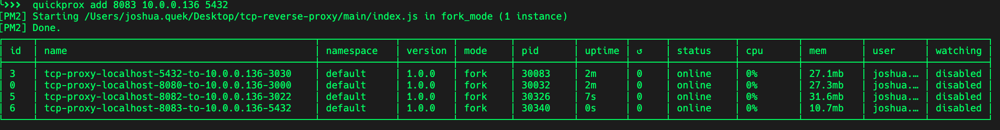
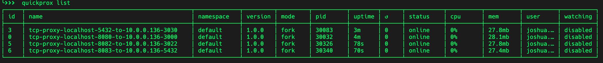
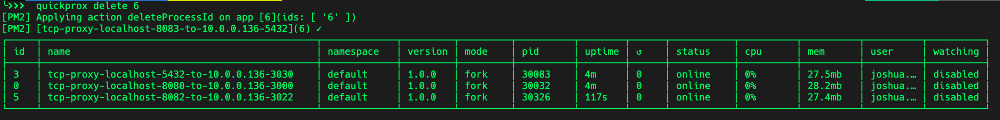
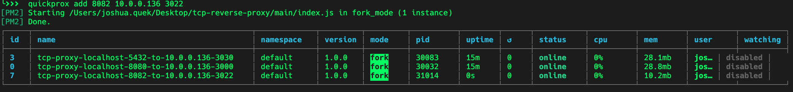

# TCP Reverse Proxy

Proxies TCP traffic from a port on your machine to another host & port that your machine is able to reach

Underneath the hood, it uses the following npm packages - `net` & `pm2`

## Setup

Ensure that you have PM2 installed, else the tool wont work:

``` bash
sudo npm install pm2 -g
```

Install rest of npm packages for this project:

``` bash
npm install
```

## Adding a TCP Proxy

Lets say you want requests that reach `localhost:3000` to be routed to `10.0.0.136:8080`:

``` bash
npm run proxy 3000 10.0.0.136 8080
```



## Viewing List of TCP Proxies

To see a list of all TCP proxies that you have created:

``` bash
npm run list
```

Take note of the `id` column, that is the value you can use later when wanting to delete TCP proxies


## Deleting a TCP Proxy

Using the `id` value from `npm run list`, you can then run

``` bash
npm run delete id_here
```

For example, if I want to delete a proxy with id equal to 1, the I would run:

``` bash
npm run delete 1
```



## Viewing Logs of TCP Proxies

To see the logs of each proxy, you can run:

``` bash
npm run status
```


As mentioned previously, this uses PM2, and you can then see each running proxy by using the arrow keys (up/down)

## Credits

[https://gist.github.com/kfox/2313683](https://gist.github.com/kfox/2313683)

## License

MIT